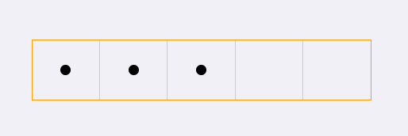

## vue-passwordbar

a vue password bar component

### Install

```bash
npm install vue-passwordbar -S

yarn add vue-passwordbar
```

### Quickstart
```javascript
require('vue-passowrdbar/dist/vue-passwordbar.css');

// in ES6 modules
import { passwordbar } from 'vue-passwordbar';

// in CommonJS
const { passwordbar } = require('vue-passwordbar');

// in Global variable
const { passwordbar } = VuePasswordbar;

Vue.component('c-passwordbar',passwordbar);
```
```html
<c-password-bar :pwd="pwd" :len="len"></c-password-bar>
```

### Params

`props`
-  `pwd`: the password, type String, default is ''
-  `len` : the password input num, type Number, default is 6

### Preview

